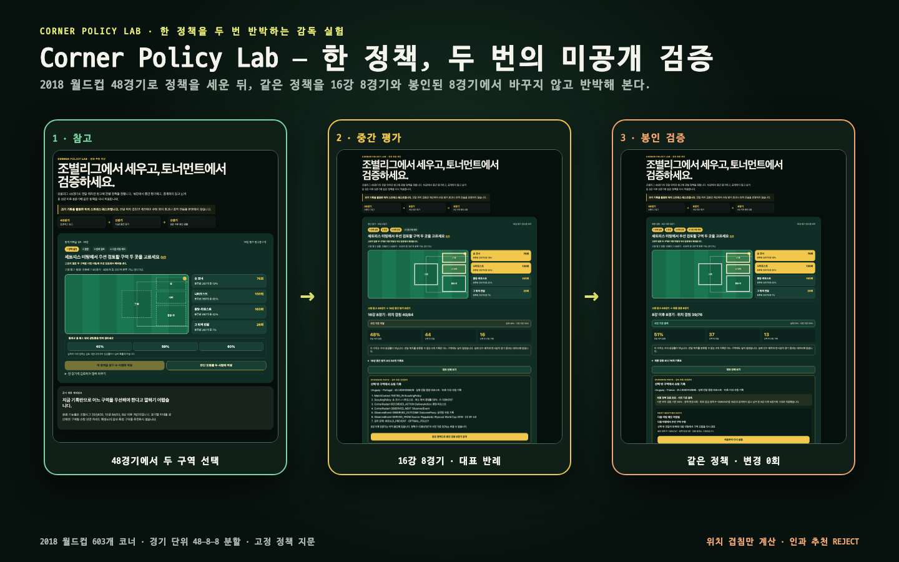

# World Cup Tactics Web Challenge 2026

DAKER monthly hackathon entry for an interactive manager experience built from
clearly labeled historical World Cup evidence. It does not claim to model a
2026 team, predict an outcome, or prove that a tactical choice prevented a shot.

## Deadlines

- Planning PDF: 2026-07-27 10:00 KST
- Deployed app, public GitHub repository, and YouTube demo: 2026-08-03 10:00 KST

Official page: https://daker.ai/public/hackathons/world-cup-manager-tactics-web-challenge

**Live judge path:** https://junhyungkang.github.io/world-cup-tactics-2026/



## Judge experience

1. Choose two corner-delivery areas from the 48 group-stage matches.
2. Lock one policy before either knockout-stage record is revealed.
3. Test the same fingerprint against the round of 16 and the sealed final eight
   matches.
4. Inspect the complete record, one deterministic contradiction, and its source
   path.
5. Record the next meeting decision without changing the sealed policy or its
   results.

The keyless path takes eight activations and fits the local captioned rehearsal
within 60 seconds. The current candidate passes 93 deterministic tests and 12/12
pre-release checks across Chromium, Firefox, WebKit, and mobile. Those machine
checks are not human-preference evidence.

## Local setup

Requires Node.js 22.12+, pnpm 11, Python 3, and Poppler (`pdftoppm`) for the
full planning-PDF evidence suite.

```bash
pnpm install
python3 -m pip install -r requirements-verify.txt
pnpm dev
pnpm verify
```

On macOS, install Poppler with `brew install poppler` before `pnpm verify`.
`pnpm dev` and `pnpm build` do not require the Python/Poppler verification tools.

The app is **Corner Policy Lab**: choose two corner-delivery areas from the
48-match group-stage reference, declare a minimum location-overlap criterion,
lock one immutable policy, then expose it
unchanged to the eight round-of-16 matches and eight still-sealed
quarter-final-and-later matches. The full record table and deterministic
representative contradiction let the historical evidence argue back. The app
measures delivery-location overlap only; causal recommendation is `REJECT` and
the empirical campaign remains `REVISE`. The final next-meeting note is a
separate decision record: it cannot mutate the locked fingerprint, the two
holdout results, or the evidence receipts.

`pnpm data:audit` checks source admission, `pnpm copy:audit` rejects known
translationese and stale Korean UI phrases, and `pnpm eligibility:audit` binds the
official DAKER no-year-restriction rule, accepted sources, selected product, and
public derived hashes. The app fails closed when the canonical build-time data
artifact is missing or invalid; it never substitutes prototype scores.

The default `pnpm verify` contract is intentionally runnable from a clean public
clone and validates the committed, SHA-bound derivative without private or
ignored raw files. Exact raw-to-derivative reproduction is a separate explicit
evidence lane: place the pinned Figshare archives and extracted JSON at the paths
recorded in `data/source-manifest.json`, then run `pnpm data:reproduce`. Missing
raw files fail that command; they are never silently skipped by the public suite.

## Data, attribution, and limits

Corner Policy Lab uses two records from Luca Pappalardo and Emanuele Massucco's
Soccer Match Event Dataset:

- [Events, Figshare item 7770599](https://figshare.com/articles/dataset/Events/7770599), DOI `10.6084/m9.figshare.7770599.v1`;
- [Matches, Figshare item 7770422](https://figshare.com/articles/dataset/Matches/7770422/1), DOI `10.6084/m9.figshare.7770422.v1`.

Both items display the [Creative Commons Attribution 4.0 International
license](https://creativecommons.org/licenses/by/4.0/). This project transforms
their 2018 World Cup subset into 603 corner restarts across all 64 matches. Of
those, 557 endpoints are classifiable and 46 remain visibly unclassified. The
public derivative preserves the fixed 48–8–8 match split, observed delivery
areas, subsequent observed events, and source IDs. It contains no continuous
tracking, player reach, reconstructed ball path, causal effect, or
author/Wyscout/FIFA/team endorsement.

## Static deployment

`pnpm build` writes a keyless, serverless site to `dist/`. The generated assets
use relative URLs, so the same bytes work at an origin root or a repository
subpath. `pnpm deployment:audit` checks asset resolution and prints the local
build digest. See `docs/static-deployment-contract.md` for the boundary between
this portable-build check and the mandatory public BG-12/final-preflight proof.

The audit reports the live Git-remote state separately; it never turns a local
build into a public-deployment claim.

The release repository includes a manually triggered GitHub Pages workflow. It
rebuilds and audits the project before uploading only `dist/`; branch pushes do
not deploy automatically. The resulting HTTPS URL becomes submission evidence
only after the remote-byte parity gate passes.

`pnpm submission:owner-console` prepares one local handoff page for the exact
planning PDF and the later web, GitHub, YouTube, and DAKER fields. It keeps the
local rehearsal visibly locked from final upload until public-release parity and
the frozen-URL recording gates pass.

## Tech stack

- Static HTML, CSS, and JavaScript for the keyless manager interaction.
- Deterministic Node transforms and release manifests for the policy campaign.
- Vitest and Playwright for unit, interaction, accessibility, and browser gates.
- Node.js 22.12+ with pnpm 11 for reproducible local commands.

## Harness

- `.agents/skills/product-gate/`: choose the differentiating manager loop.
- `.agents/skills/data-audit/`: admit data and assets with provenance/license.
- `.agents/skills/browser-acceptance/`: verify the keyless judging path.
- `.agents/skills/korean-copy-qa/`: preserve claims while polishing Korean copy.
- `.agents/skills/submission/`: freeze the planning and final artifacts.
- `docs/product-thesis.md`: candidate and selected concept state.
- `docs/data-scope-eligibility-contract.md`: fail-closed 2026 data-scope routes.
- `docs/decision-registry.md`: accepted and rejected decisions.
- `docs/session-handoff.md`: exact resume state.
